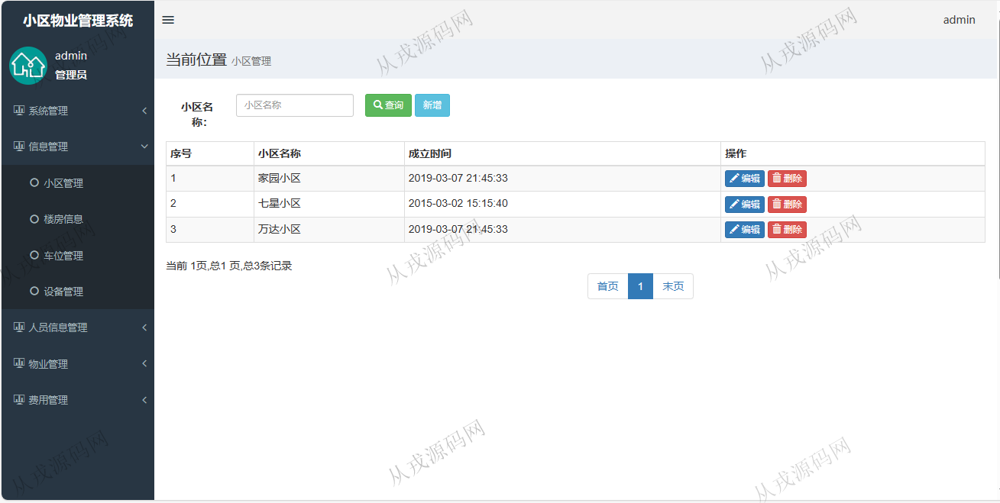
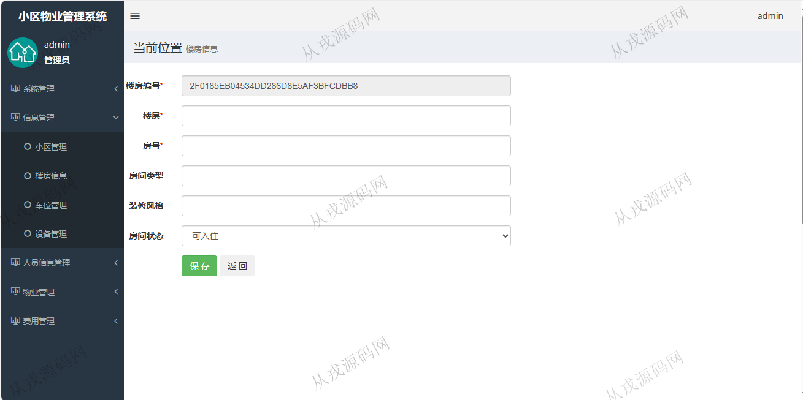
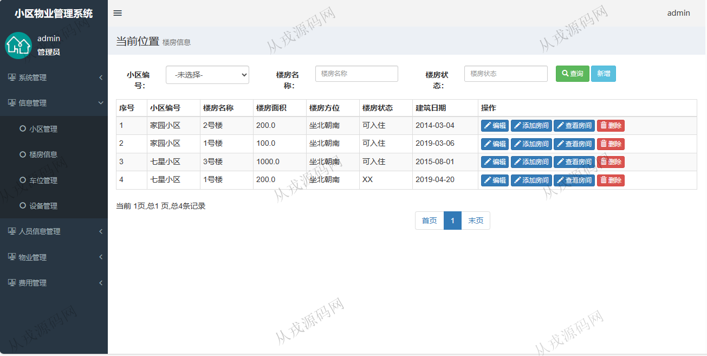
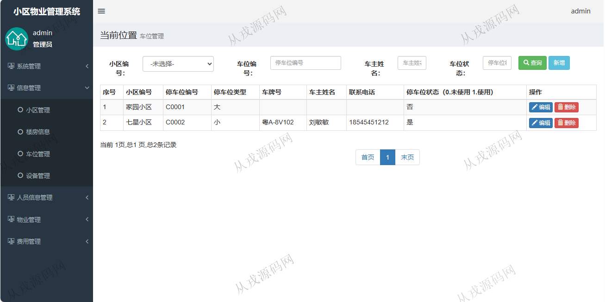
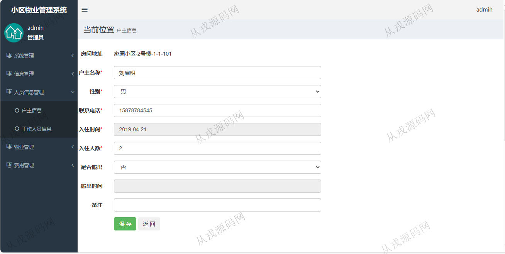
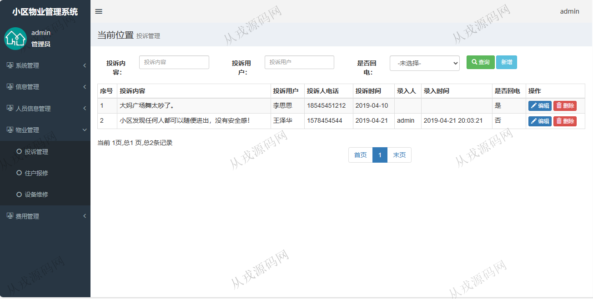
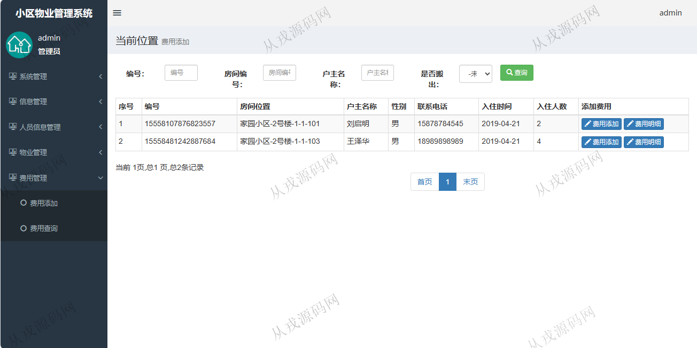
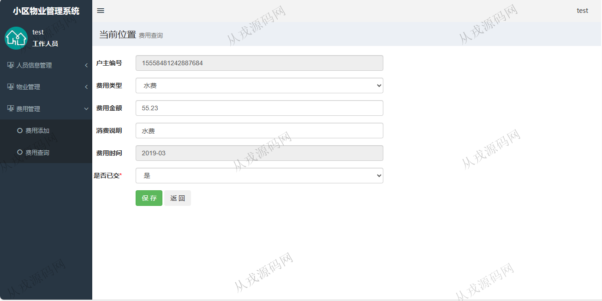

<h1 align="center">159.小区物业管理系统</h1>

- <b>完整代码获取地址：从戎源码网 ([https://armycodes.com/](https://armycodes.com/))</b>
- <b>技术探讨、资料分享，请加QQ群：692619798</b> 
- <b>作者微信：19941326836  QQ：952045282</b> 
- <b>承接计算机毕业设计、Java毕业设计、Python毕业设计、深度学习、机器学习</b>
- <b>选题+开题报告+任务书+程序定制+安装调试+论文+答辩ppt 一条龙服务</b>
- <b>所有选题地址 ([https://github.com/YuLin-Coder/AllProjectCatalog](https://github.com/YuLin-Coder/AllProjectCatalog)) </b>
## 项目介绍
基于springboot的小区物业管理系统：前端 html、jquery，后端 maven、springmvc、spring、mybatis；角色分为管理员、工作人员；集成投诉管理、住户报修、设备维修、费用管理等功能于一体的系统。

## 功能介绍

- 用户管理：用户信息的增删改查，用户也可以自行注册
- 通知列表：通知信息的增删改查，按标题和作者来搜索查询
- 小区管理：按小区名称搜索查询，小区信息增删改查
- 楼房信息：楼房信息增删改查，给楼房添加房间，查看房间信息
- 车位管理：车位信息的增删改查，多条件搜索查询
- 设备管理：设备信息的增删改查，按设备名称和小区编号查询
- 户主信息：户主信息的增删改查，多条件搜索查询
- 投诉管理：投诉信息的增删改查，多条件搜索查询
- 住户报修：报修信息的增删改查，多条件搜索查询，是否处理
- 设备维修：维修信息的增删改查，按设备名称搜索查询
- 费用管理：费用信息的增删改查，多条件搜索查询

## 环境

- <b>IntelliJ IDEA 2021.3</b>

- <b>Mysql 5.7.26</b>

- <b>Tomcat 7.0.73</b>

- <b>JDK 1.8</b>

## 运行截图

